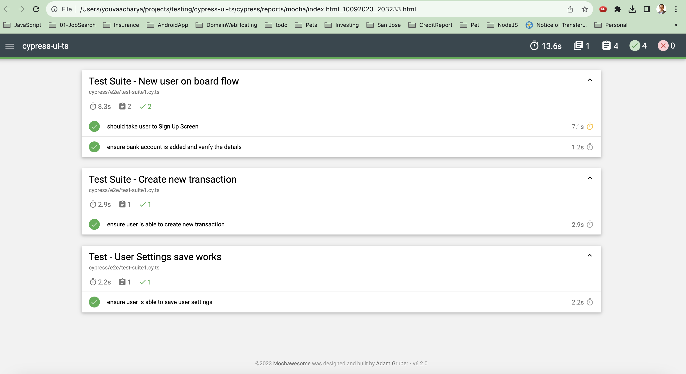

# Cypress UI Test Automation with TypeScript

This is a boiler plate UI test automation framework that uses Cypress with TypeScript and uses page object model design pattern.

## Description

This UI test automation framework based on Cypress contains the following properties.

- Cypress and TypeScript
- Modular Architecture
- Page Object Model (POM) - dedicated page objects for each web page or component with the application. It encapsulate page interaction and corresponding page elements are maintained in separate file
- Test Data Separation - Test data is stored in separate file that are matached with the test suite.
- Reusable components - common actions and behavior of each page are isolated in base page and common actions like clicking , typing, and selecting are maintained in actions class.

## Getting Started

### Installing

- Go to the root folder in command line and run the following command.
  ```
  npm install
  ```

### Pre-Requisite

- Sample test scripts are designed to run on demo application created by Cypress.
  You need to download the stand alone app from github [https://github.com/cypress-io/cypress-realworld-app]and run the test.
  Or if you just want to look and follow the framework you feel free to modify the url and other code based on your url.
  The main idea is to provide the structure and basic guidelines.

### Executing program

- Go to the root folder in terminal and run the command this will run the test in headed ( browser will be shown)

```
npm test
```

Note: You can update the test script in package.json to run the test in headless mode.

```
  "scripts": {
    "test": "npx cypress run --browser chrome --spec 'cypress/e2e/test-suite1.cy.ts'",
    "generate-report": "marge cypress/reports/mocha/.jsons/*.json -f report.html"
  },
```

## Screenshot

If you ran the test in headles mode than Mocha test report are generated at cypress/reports/mocha/\*.html



## Authors

Youva Acharya\
youvaraj@gmail.com
